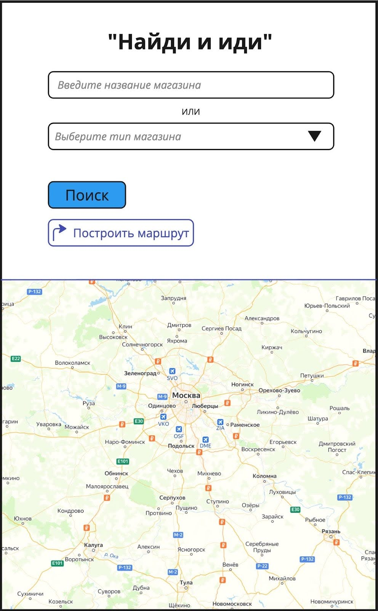

### Задание 1. Практическое тестирование документации
Приложение «Найди и иди» предназначено для поиска нужного пользователям магазина и построения маршрута до него. Для упрощения задания считаем, что геолокация всегда разрешена приложению.

Техническое задание:

|**ID требования**|**Описание требования**|
| - | - |
|SC21-01|**Поле ввода названия магазина** - Поле ввода названия магазина принимает любые символы. - Поле содержит плейсхолдер. - Плейсхолдер исчезает при вводе символов. - Минимальное количество символов — 2. - В поле сохраняются результаты предыдущих поисков.|
|SC21-02|**Поле выбора типа магазина** - Поле выбора типа магазина представляет собой выпадающее меню со следующими вариантами выбора значений: 1. «Продуктовые магазины»; 2. «Магазины стройматериалов»; 3. «Аптеки». - Поле содержит плейсхолдер «Выберите тип магазина». - При наличии выбранного значения оно отображается в поле.|
|SC21-03|**Кнопка «Поиск»** - Кнопка «Поиск» активна только в случае заполнения минимум одного поля (некликабельна при отсутствии заполнения обоих полей). - Успешные результаты поиска отображаются в виде флажков на карте. - Карту можно скроллить и зуммировать (стандартные жесты).|
|SC21-04|**Кнопка «Построить маршрут»** - Кнопка «Построить маршрут» активна в следующих случаях: 1. Найден результат поиска введенного пользователем названия магазина и выбран его флаг на карте. 2. Выбран тип магазина (маршрут будет построен до ближайшего магазина с указанным типом). - Кнопка содержит иконку в виде изогнутой стрелки,  надпись «Построить маршрут» и цвет фона #fff (белый). - При нажатии на кнопку цвет фона меняется на #586d73 (серый) и название кнопки меняется с «Построить маршрут» на «Отменить маршрут».|
|SC21-05|**Область карты** - Область карты занимает половину области экрана телефона. - Для построения маршрута требуется выполнение условий в требовании **SC21-04**. - Построенный маршрут можно отменить только нажатием кнопки «Отмена».|
|SC21-06|**Общие требования к работе приложения** - При повторном открытии приложения отображать незаконченный ранее маршрут. - Отключать точную геопозицию при низком заряде аккумулятора.|

1. Выполнить тестирование данного ТЗ.
4. Расписать, какая фраза содержит ошибку, к какому критерию эта ошибка относится и пункты пояснения, почему это ошибка.

### Задание 2. Black-box
1. Основываясь только на ТЗ из задания 4, написать чек-лист проверок по методике Black-box.
1. Выполненное задание оформи в файле *task\_4.md.*

### Задание 3. Grey-box

1. Основываясь на данных, указанных выше, написать чек-лист проверок по методике  Grey-box.

